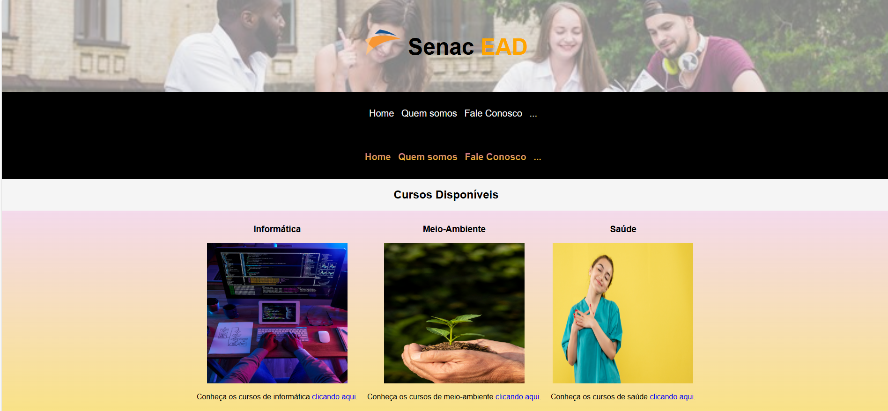
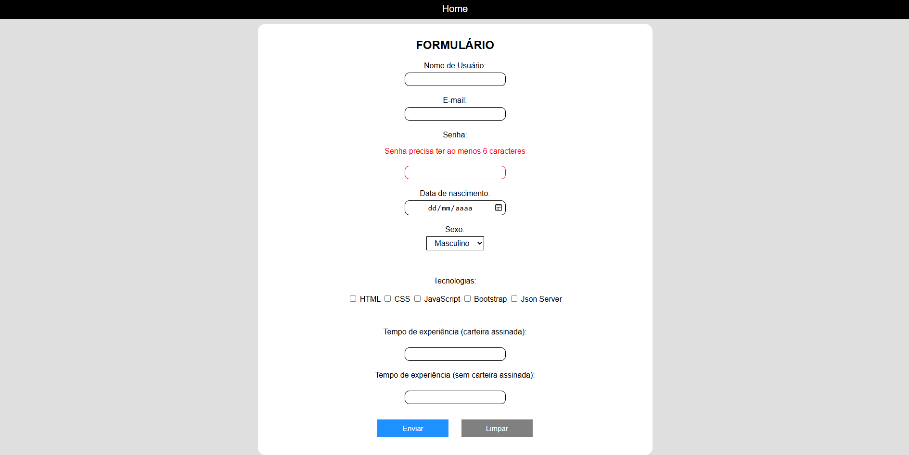
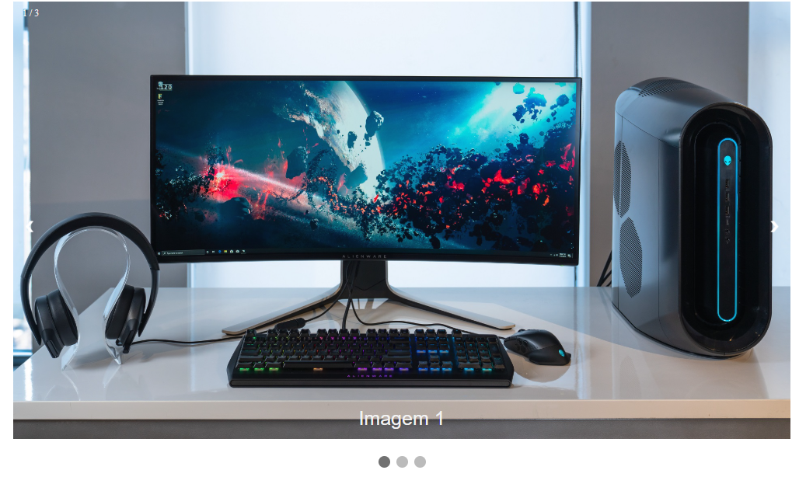

# Projetos Turma 11960

## Sobre o repositório 📝
Projetos desenvolvidos durante as aulas do módulo 3 em TDS com as turmas 11960, 12202, 11813 e 11968.

## Projetos disponíveis ✅

### 1. Validação de Formulário
Projeto desenvolvido durante os Momentos Online onde aprendemos como utilizar as tecnologias HTML e CSS.
#### Captura de tela do projeto 📸

### 2. Validação de Formulário
Projeto desenvolvido para exemplificar o processo de validação dos mais diferentes campos de formulários e como trabalhar com eventos em JavaScript.

#### Captura de tela do projeto 📸

### 3. Exemplo de Slideshow
Projeto desenvolvido para exemplificar a criação de um Slideshow utilizando apenas HTML, CSS e JavaScript - sem bibliotecas ou frameworks.

#### Captura de tela do projeto 📸

## Tecnologias 💻
- HTML
- CSS
- JavaScript